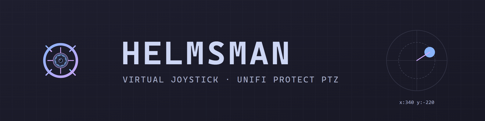
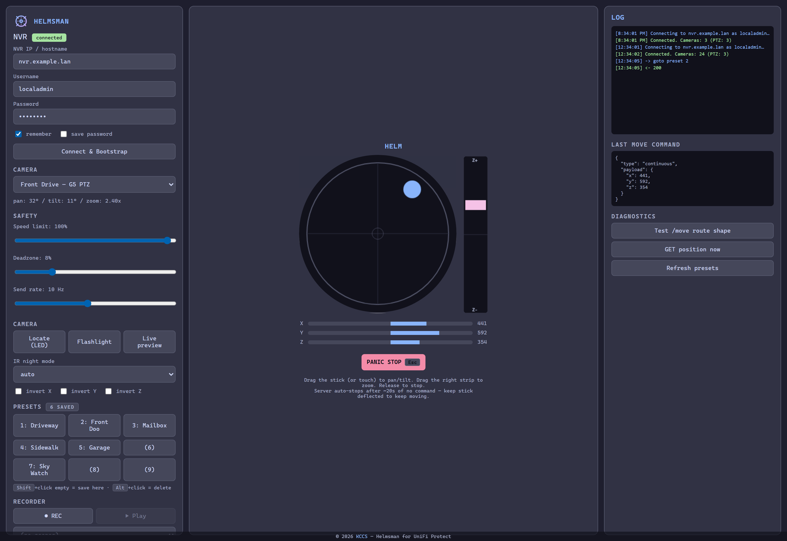
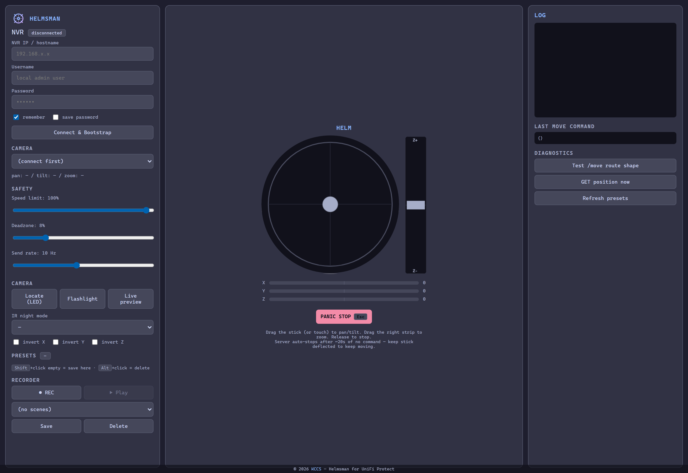
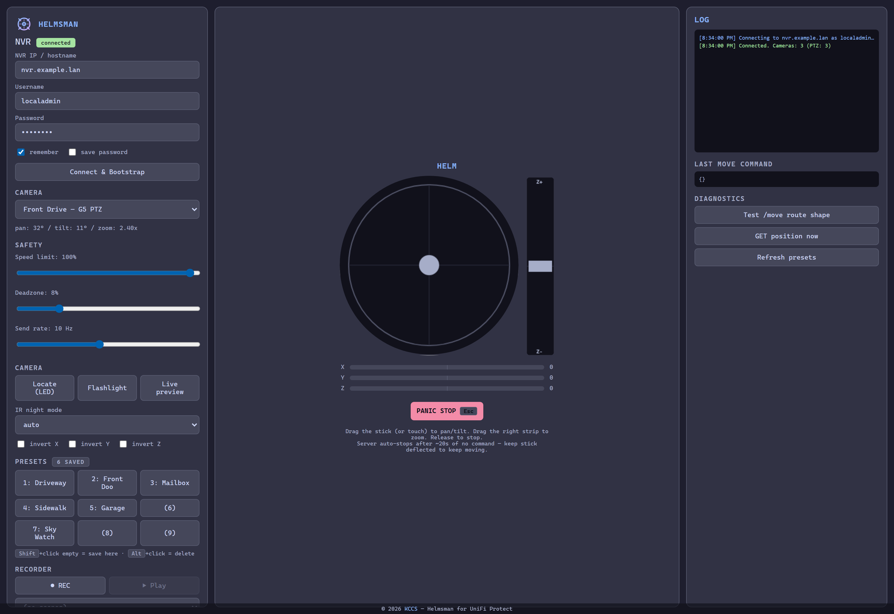

<p align="center">
  
</p>

<p align="center">
  <em>Drag the wheel — your camera moves. A virtual joystick PTZ controller for UniFi Protect.</em>
</p>

<p align="center">
  <a href="docs/USERGUIDE.md"></a>
  <a href="docs/API-REFERENCE.md"></a>
  
  
  
</p>

---

## What is this

Ubiquiti's UniFi Protect web app lets you click a point in a PTZ camera's live view to swing toward it, but it doesn't ship a joystick mode. **Helmsman is that joystick mode.**

Spin up a single Python file, open the browser tab it pops, and drive any PTZ-capable Protect camera from a virtual stick that talks to the same internal API the Protect web UI uses for click-and-drag.

<p align="center">
  
</p>

---

## Features

### Driving
- 🕹️ **Virtual joystick** — mouse, touch, pointer events
- 🎮 **USB joystick / gamepad** — Xbox / PS / generic HID via browser GamepadAPI
- ⌨️ **Keyboard nudges** — arrow keys + `+/-`, `Shift` for bigger steps
- 📺 **Live snapshot preview behind the helm** — see what you're aiming at
- 🔍 **Separate zoom strip** for one-handed zoom

### Cameras
- 🎯 **Inline preset save / rename / delete** — `Shift`+click an empty slot to save here
- 💡 **Camera controls** — locate, flashlight, IR night mode toggle
- 🔄 **Per-camera axis flips** for upside-down mounts
- 🎬 **Move recorder + scene replay** — record gestures, replay at original timing

### Operations
- 🔐 **Saved credentials** with OS keyring (Windows Cred Manager / Keychain / libsecret) — auto-connect on launch
- 🛡️ **Server-side dead-man timer** — NVR auto-stops if the bridge dies
- ⌨️ **Panic stop** on `Esc`, gamepad Start, or big red button
- 📏 **Speed limit / deadzone / send rate** sliders
- 📊 **Live position + payload log** — see exactly what's being sent
- 📱 **Telegram notifications** (optional) on session start + first PTZ command
- 🎨 **Catppuccin Mocha** theme, KCCS branded
- 📦 **Single Python file** OR **one-click Windows `.exe`** (~14 MB)

---

## Run it

### Easiest — Windows one-click

Download `Helmsman.exe` from the [Releases](https://github.com/pueblokc/helmsman/releases) page and double-click. Browser pops, you type NVR IP / user / password, you're driving.

### From source

```bash
git clone https://github.com/pueblokc/helmsman.git
cd helmsman
pip install -r requirements.txt
python helmsman.py
```

### Build your own .exe

```powershell
pip install pyinstaller pillow
powershell -ExecutionPolicy Bypass -File build/build.ps1
```

Browser opens to `http://127.0.0.1:8765`. Tick **remember** + **save password** to auto-connect on next launch.

> 📖 **Read the [User Guide](docs/USERGUIDE.md)** for first-connect walkthrough, gamepad mapping, troubleshooting, security model, and FAQ.

---

## Screenshots

<table>
<tr>
<td width="50%">
<p align="center"><b>Disconnected — fresh open</b></p>

</td>
<td width="50%">
<p align="center"><b>Connected — pick a PTZ camera, see its presets</b></p>

</td>
</tr>
<tr>
<td colspan="2">
<p align="center"><b>Active — stick deflected, camera swinging, payload visible in real time</b></p>

</td>
</tr>
</table>

---

## How it works

```
[browser stick]  --POST /api/move-->  [helmsman.py]  --HTTPS POST--> [NVR /proxy/protect/api/cameras/:id/move]
                                       (cookie + CSRF)                  {type:"continuous", payload:{x,y,z}}
```

`helmsman.py` is a tiny HTTP server that:
1. Serves the joystick UI (HTML + JS, embedded inline)
2. Authenticates against your NVR (HTTPS, cookie + CSRF)
3. Forwards joystick deflection to Protect's continuous-move endpoint at your chosen rate

The continuous-move endpoint is the **same internal API** the Protect web UI uses for click-to-move. We're inside the supported envelope, just exposing it as a stick.

> 🧪 **Want the full reverse-engineered API map?** See the [API Reference](docs/API-REFERENCE.md).

---

## Verified

Tested against:
- **NVR:** UNVR (Debian 11 / aarch64), Protect **7.1.46**
- **Camera:** UVC G5 PTZ (`featureFlags.isPtz: true`, pan ±175°, tilt -10°/+90°, zoom 1×–2×)

Should also work with:
- G4 PTZ (same API surface, untested by us — reports welcome)
- Any future Protect camera that exposes `featureFlags.isPtz: true` in the bootstrap

---

## Roadmap

### Done
- [x] Hardware joystick / gamepad (v0.2)
- [x] Saved credentials with OS keyring (v0.2 + v0.3)
- [x] Multi-camera quick-switch (v0.2)
- [x] Native single-binary build (v0.2)
- [x] Live snapshot preview (v0.3)
- [x] Inline preset save / rename / delete (v0.3)
- [x] Per-camera axis-flip toggle (v0.3)
- [x] Move recorder + scene replay (v0.3)
- [x] Spotlight / IR / locate controls (v0.3)
- [x] Keyboard nudges (v0.3)
- [x] Telegram notifications (v0.3)

### Coming
- [ ] Live H.264 / WebRTC stream behind the helm (vs current 1 Hz snapshot)
- [ ] Stream Deck plugin
- [ ] Optional auth on the local UI when bound to 0.0.0.0
- [ ] Talkback (push-to-talk) — Protect WS protocol is non-trivial
- [ ] Multi-camera grid view (drive any of N PTZs from one stick)

---

## Contributing

This is a KCCS internal tool released as a courtesy. Issues and PRs welcome but not actively solicited. If you build something cool with it, let us know — we'd love to hear.

## License

Proprietary — © 2026 KCCS. All rights reserved.

---

<p align="center">
  Built with 🔭 by <a href="https://kccsonline.com"><b>KCCS</b></a>
</p>
